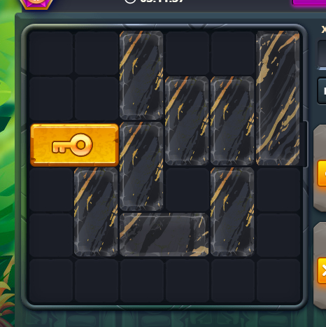

## Unblock Me Solver

This project is designed to recognize and solve "Unblock Me"-style mazes using Breadth-first search algorithm([Wiki](https://en.wikipedia.org/wiki/Breadth-first_search)) and computer vision algorithms.

## Features

- Maze recognition in the selected screen region
- Solution calculation algorithm
- Solution automation using simulated mouse movement

## Usage

```
dotnet restore
dotnet run
```

Test image is included (test.jpg) that is known to be working good for demonstration purposes.



## Compatibility

Algorithm is platform-agnostic, but since dll hooks are used, project will only run on Windows
